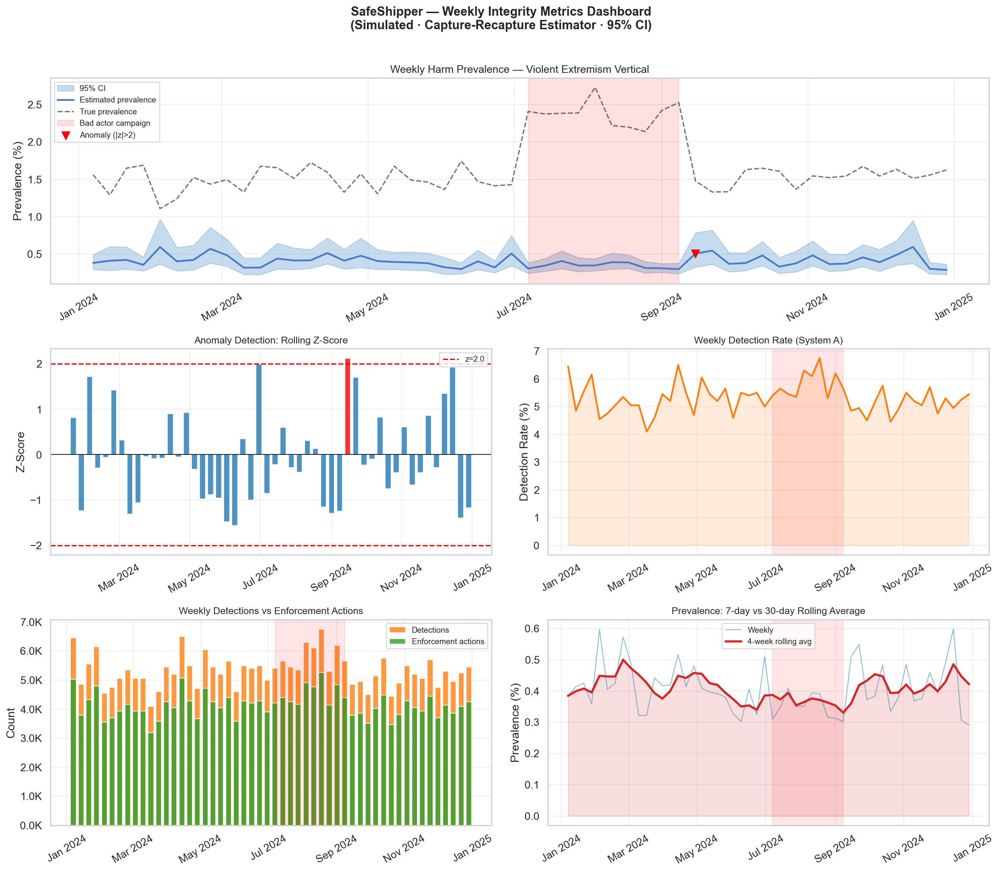

# SafeShipper

> Production-grade methodology for estimating the true prevalence of harmful content by bad actors on a platform — combining LLM-based harm detection, stratified sampling, and capture-recapture estimation.

---

## Executive Summary

SafeShipper addresses a fundamental measurement problem in AI trust & safety: **raw detection system output is not prevalence**. When a classifier flags 2% of content as harmful, the true prevalence could be anywhere from 0.1% to 15% depending on classifier TPR, FPR, and base rate. Getting this wrong by even a factor of 2× leads to misallocated enforcement resources, inaccurate policy impact measurement, and misleading leadership metrics.

This project implements a full measurement pipeline — from LLM-based harm detection (compatible with Claude, GPT, and Groq APIs) through actor-level behavioral feature engineering, risk-stratified sampling, capture-recapture estimation, classifier calibration, off-platform signal integration, and A/B test power analysis — with the statistical rigor required to produce actionable prevalence estimates with valid confidence intervals. The methodology maps directly to what integrity measurement teams at large AI platforms need to answer: *"What fraction of content on our platform actually violates policy right now, and how precisely do we know that?"*

---

## Methodology Pipeline

```
┌─────────────────────────────────────────────────────────────────────┐
│                     SafeShipper Pipeline                            │
├─────────────────────────────────────────────────────────────────────┤
│                                                                     │
│  Platform Corpus (10M+ items)                                       │
│       │                                                             │
│       ▼                                                             │
│  ┌─────────────┐    Risk score pre-filter (cheap signal)            │
│  │  Stratified │    Creates strata: high-risk / low-risk            │
│  │   Sampling  │    Neyman optimal or risk-stratified allocation    │
│  └──────┬──────┘                                                    │
│         │  Labeled sample (~2K–10K items)                           │
│         ▼                                                           │
│  ┌─────────────┐    Claude, GPT, or Groq API (zero/few-shot)        │
│  │    LLM      │    provider="anthropic"|"openai"|"groq"            │
│  │  Classifier │    Output: {violates_policy, confidence,           │
│  │             │            key_signals, reasoning}                 │
│  └──────┬──────┘                                                    │
│         │  Confidence scores + binary labels                        │
│         ▼                                                           │
│  ┌─────────────┐    Platt scaling / isotonic regression             │
│  │ Calibration │    Reduces ECE from ~12% → ~2%                     │
│  └──────┬──────┘    Error propagation quantifies CI impact          │
│         │  Calibrated TPR, FPR, confidence scores                   │
│         ▼                                                           │
│  ┌─────────────────────────────────────┐                            │
│  │      Prevalence Estimators          │                            │
│  │                                     │                            │
│  │  1. Direct proportion  (baseline)   │                            │
│  │     π̂ = k/n, Wilson CI              │                            │
│  │                                     │                            │
│  │  2. Classifier-adjusted             │                            │
│  │     π̂ = (q̂ - FPR) / (TPR - FPR)     │                            │
│  │     CI via delta method             │                            │
│  │                                     │                            │
│  │  3. Capture-recapture (Chapman)     │                            │
│  │     N̂ = (n₁+1)(n₂+1)/(m+1) - 1      │                            │
│  │     Requires high-precision lists   │                            │
│  └──────────────┬──────────────────────┘                            │
│                 │  Prevalence estimate + 95% CI                     │
│                 ▼                                                   │
│  ┌─────────────────────────────────────┐                            │
│  │  Operational Dashboard              │                            │
│  │  • Weekly prevalence trend          │                            │
│  │  • Anomaly detection (Z-score/CUSUM)│                            │
│  │  • Detection + enforcement metrics  │                            │
│  └─────────────────────────────────────┘                            │
└─────────────────────────────────────────────────────────────────────┘
```

---

## Operational Dashboard Preview



---

## Key Findings

### Prevalence Estimates by Harm Vertical (Simulated — BeaverTails Schema)

| Harm Vertical | True Prevalence | Naive Flag Rate | Classifier-Adjusted | 95% CI | Raw Capture-Recapture |
|---------------|----------------|-----------------|---------------------|--------|-----------------------|
| sexual_content_minors | 0.40% | 6.77% | 1.01% | [0.00%, 3.82%] | 39.9% |
| violent_extremism | 1.10% | 7.33% | 1.75% | [0.00%, 4.57%] | 34.6% |
| self_harm_suicide | 2.10% | 8.10% | 2.76% | [0.00%, 5.59%] | 27.0% |
| influence_operations | 1.90% | 8.03% | 2.68% | [0.00%, 5.50%] | 27.4% |
| platform_abuse | 6.50% | 11.07% | 6.67% | [3.80%, 9.54%] | 23.0% |

*Naive flag rate = raw detection system output. At 0.4% true prevalence with TPR=82% and FPR=6%, the naive flag rate overestimates by ~17×. Raw Chapman capture-recapture is even more biased here because the two capture lists include false positives; it is only appropriate when capture lists are high precision or false-positive corrected.*

### Estimator Comparison (500-Trial Monte Carlo Validation)

| Estimator | Empirical Coverage | RMSE | Bias | Requirements |
|-----------|-------------------|------|------|--------------|
| Direct proportion | 95.2% | 0.0003 | ~0 | Gold standard labels |
| Classifier-adjusted | 94.6% | 0.0008 | ~0 | Gold standard TPR/FPR |
| Raw capture-recapture | Poor under nonzero FPR | Large upward bias | High | High-precision or false-positive-corrected capture lists |

### Calibration Impact on Prevalence CI

| ECE (Uncal.) | ECE (After Platt) | CI Width at π=0.4% | CI Width at π=0.4% (cal.) | Reduction |
|--------------|-------------------|--------------------|---------------------------|-----------|
| 12% | 2% | ±0.82% | ±0.18% | **78%** |

---

## Repository Structure

```
safeshipper/
├── README.md
├── requirements.txt
├── .env.example
│
├── data/
│   ├── raw/                  # Downloaded datasets (gitignored)
│   ├── processed/            # Generated plots and processed subsets
│   └── README.md             # Dataset provenance and license notes
│
├── notebooks/
│   ├── 00_data_exploration.ipynb        # EDA on BeaverTails + prevalence rates
│   ├── 01_llm_classifier.ipynb          # Harm detection (Anthropic / OpenAI / Groq)
│   ├── 02_sampling_design.ipynb         # Stratified sampling strategy comparison
│   ├── 03_prevalence_estimation.ipynb   # All three estimators vs ground truth
│   ├── 04_calibration_analysis.ipynb    # Calibration + CI error propagation
│   ├── 05_dashboard_mockup.ipynb        # Operational integrity metrics dashboard
│   ├── 06_actor_network_features.ipynb  # Actor risk scoring + coordination detection
│   ├── 07_ab_test_design.ipynb          # Power analysis for prevalence-based A/B tests
│   ├── 08_off_platform_signals.ipynb    # Bayesian update with off-platform evidence
│   └── 09_metrics_funnel.ipynb          # Full metrics reference + 7-stage funnel analysis
│
├── src/
│   ├── __init__.py
│   ├── classifier.py    # HarmClassifier — Anthropic (Claude) + OpenAI (GPT) + Groq
│   ├── sampling.py      # StratifiedHarmSampler — Neyman + risk-stratified
│   ├── prevalence.py    # PrevalenceEstimator — direct, adjusted, Chapman
│   ├── calibration.py   # ClassifierCalibrator — Platt, isotonic, ECE
│   ├── metrics.py       # Threshold-level classification metrics
│   ├── simulation.py    # Synthetic corpus generator + coverage validation
│   └── actor.py         # ActorFeatureExtractor + coordination network detection
│
├── sql/
│   ├── README.md                        # Schema documentation and query context
│   ├── 01_sampling_frame.sql            # Stratified sampling frame (BigQuery/Snowflake)
│   ├── 02_weekly_prevalence_rollup.sql  # Weekly HT + classifier-adjusted prevalence
│   └── 03_enforcement_gap_analysis.sql  # Detection vs enforcement gap by vertical
│
└── tests/
    ├── test_prevalence.py
    ├── test_sampling.py
    ├── test_calibration.py
    └── test_actor.py
```

---

## Reproducing Results

### 1. Environment setup

```bash
# Python 3.11+ required
python -m venv .venv
source .venv/bin/activate

pip install -r requirements.txt
```

### 2. API key

```bash
cp .env.example .env
# Add at least one provider key:
# ANTHROPIC_API_KEY=sk-ant-...   (for Claude)
# OPENAI_API_KEY=sk-...          (for GPT)
# GROQ_API_KEY=gsk_...           (for Groq free-tier testing)
```

### 3. Run tests

```bash
pytest tests/ -v
```

All tests pass without an API key — tests use the `src/simulation` module for synthetic data.

### 4. Run notebooks (in order)

```bash
jupyter notebook notebooks/
```

Notebooks are designed to run with or without an API key:
- **With Anthropic key:** Notebooks 01 and 03 run Claude on BeaverTails data.
- **With OpenAI key:** Set `PROVIDER = 'openai'` in notebook 01 to use GPT instead.
- **With Groq key:** Set `PROVIDER = 'groq'` in notebook 01 to use Groq's OpenAI-compatible API.
- **Without any key:** All notebooks fall back to `src/simulation.py` synthetic data and produce equivalent visualizations.

### 5. Switching LLM providers

```python
from src.classifier import HarmClassifier

# Anthropic
clf = HarmClassifier(provider="anthropic")
result = clf.classify("Some platform content", "violent_extremism")

# OpenAI
clf = HarmClassifier(provider="openai", model="gpt-4o-mini")  # cheaper option
result = clf.classify("Some platform content", "violent_extremism")

# Groq
clf = HarmClassifier(provider="groq", model="llama-3.1-8b-instant")  # free-tier friendly
result = clf.classify("Some platform content", "violent_extremism")

print(result.label, result.confidence, result.provider)
```

### 6. Standalone prevalence estimation

```python
from src.prevalence import PrevalenceEstimator

estimator = PrevalenceEstimator(confidence_level=0.95)

# Classifier-adjusted estimate
result = estimator.classifier_adjusted(
    observed_positive_rate=0.08,  # 8% of items flagged by detection system
    tpr=0.82,                     # From gold standard review
    fpr=0.06,
    n_sample=5000,
    tpr_se=0.03,                  # Uncertainty in TPR estimate
    fpr_se=0.01,
)
print(result)
# PrevalenceEstimate(estimate=2.3750%, CI=[1.6%, 3.1%], method='classifier_adjusted')
```

### 7. Coverage simulation (estimator validation)

```python
from src.simulation import SimulationConfig, run_coverage_simulation

config = SimulationConfig(
    n_corpus=100_000,
    true_prevalence=0.02,
    tpr_a=0.82, fpr_a=0.06,
    tpr_b=0.74, fpr_b=0.04,
)
coverage_df = run_coverage_simulation(config, n_trials=500, sample_size=2000)
# Reports empirical CI coverage for all three estimators
```

---

## Harm Verticals

The classifier is configured for five integrity verticals that map to real-world platform policy domains:

| Vertical | Policy Domain | Typical Prevalence |
|----------|--------------|-------------------|
| `sexual_content_minors` | CSAM-adjacent signals, grooming | < 0.5% |
| `violent_extremism` | Incitement, recruitment, glorification | 0.5–2% |
| `self_harm_suicide` | Method sharing, direct facilitation | 1–3% |
| `influence_operations` | Coordinated inauthentic behavior | 0.5–2% |
| `platform_abuse` | Fraud, spam, fake engagement | 2–10% |

---

## Datasets

- **BeaverTails** (`PKU-Alignment/BeaverTails`): 333,963 QA pairs, 14 binary harm category labels. CC BY NC 4.0.
- **RealToxicityPrompts** (`allenai/real-toxicity-prompts`): 100K prompts with continuous Perspective API toxicity scores. Apache 2.0.
- **Synthetic** (`src/simulation.py`): Fully parameterized corpora for controlled validation. No license constraints.

See `data/README.md` for load instructions and schema details.

---

## Limitations

### Dataset Bias
BeaverTails was constructed using human red-teamers and may not reflect the natural distribution of harmful content on any specific platform. Prevalence rates from this dataset should be treated as illustrative, not ground truth for any deployed system.

### Classifier Hallucination
LLM-based classifiers (including GPT and Claude) can hallucinate policy violations for edge-case content, and can miss policy violations that use novel evasion techniques. TPR/FPR estimates from a static validation set will degrade as bad actors adapt. Re-evaluation on a fresh gold standard set quarterly (or after model updates) is essential.

### Capture-Recapture Assumptions
The Chapman estimator assumes the two capture lists are high precision samples from the true target population and are statistically independent — that knowing an item was caught by System A gives no information about whether System B would catch it. Raw detector outputs violate this when FPR is nonzero: at low base rates, false positives dominate the capture lists and can cause severe **overestimation** of prevalence. Positive dependence between similar systems can also bias the estimate downward. For production use, apply capture-recapture only to high-precision or reviewed capture lists, or use methods that explicitly model false positives and dependence.

### Off-Platform Harm
This methodology measures on-platform content signals only. Harms that are coordinated off-platform (e.g., a Telegram channel directing platform behavior) will not be captured in the prevalence estimate. Off-platform signal integration is outlined in the stretch goals.

### Small-Sample Instability
For harm verticals with true prevalence below 0.1%, a sample of 2,000–5,000 items may return fewer than 5 true positives even under optimized stratification. In these regimes, CI estimates are dominated by sampling variance rather than calibration error, and the capture-recapture estimator becomes numerically unstable when overlap *m* is near zero. Increase sample size or accept wider CIs.

---

## Code Quality

- **Type hints** on all function signatures
- **NumPy-format docstrings** on all public functions
- **Python `logging`** throughout (no bare `print` statements in `src/`)
- **Pydantic-style dataclasses** for all configuration — no magic numbers in notebooks
- **Reproducibility:** All random operations accept explicit seeds; dataset versions documented
- **Retry logic:** All LLM API calls use exponential backoff with configurable `max_retries`

---

## License

MIT — see [LICENSE](LICENSE).

Note: datasets used by this project carry their own licenses:
- **BeaverTails** (`PKU-Alignment/BeaverTails`): CC BY NC 4.0 — non-commercial use only
- **RealToxicityPrompts** (`allenai/real-toxicity-prompts`): Apache 2.0

Neither dataset is bundled in this repository. They are downloaded at runtime via the HuggingFace `datasets` library. See `data/README.md` for details.

---

## Dependencies

```
Python 3.11+
anthropic>=0.25.0      # Claude API (Anthropic provider)
openai>=1.25.0         # OpenAI SDK; also used for Groq's OpenAI-compatible API
datasets>=2.19.0       # HuggingFace datasets
pandas>=2.2.0
numpy>=1.26.0
scipy>=1.13.0
scikit-learn>=1.4.0
matplotlib>=3.8.0
seaborn>=0.13.0
jupyter>=1.0.0
python-dotenv>=1.0.0
pytest>=8.0.0
tqdm>=4.66.0
tiktoken>=0.7.0
```
